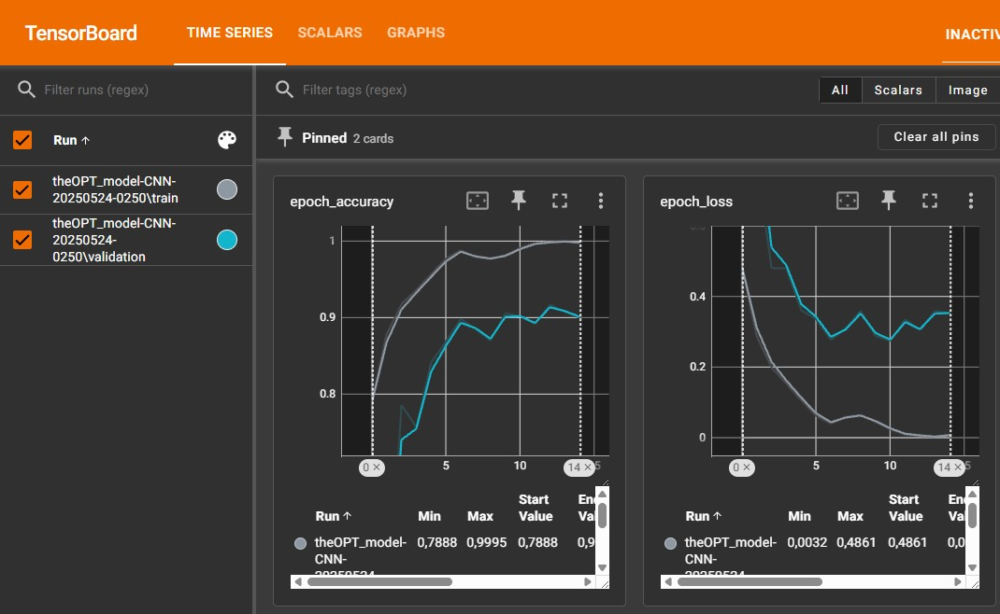
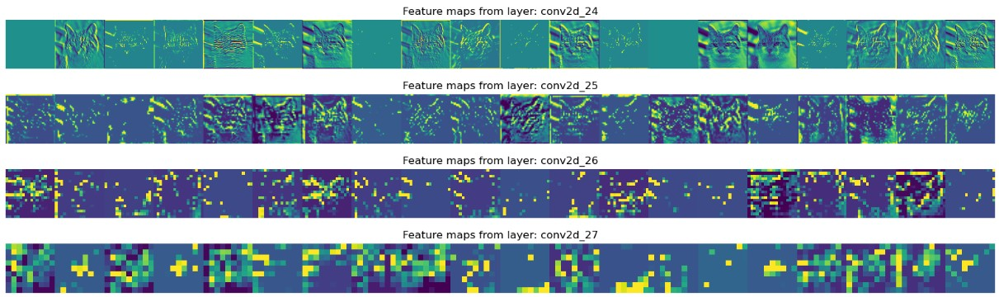
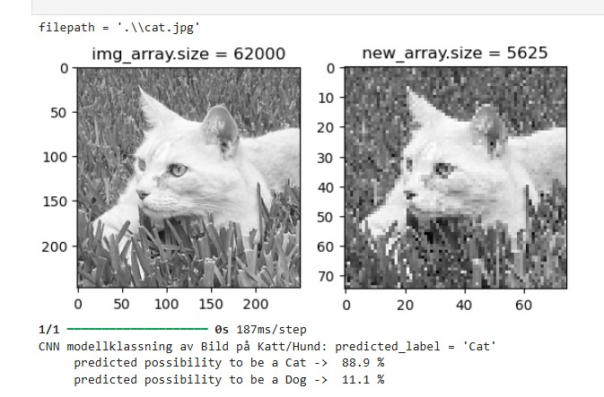

# PythonKurs_In2_SKARP

## Pythonprogrammering för AI-utveckling / Egna projektet - del 2
**Skilj på katter och hundar** från foton ur verkliga livet. Bygga upp en modell som som kan skilja på katter och hundar utifrån fotografier. Träningsdata baseras på foton med de enskilda djuren.  

# Förberredelse av data
Använder **jupyter notebook** till förberedelser av bilder
## file: **./Cats_and_Dogs/steg1_CatDog.ipynb**
- Samla in data
- Tvätta data
- Dela upp data - data för Träning & Test
    - 7700 foton för  & Evaluering (70/30) intern anpassning
    - 7700 foton för Träning, 3500 kattbilder & 4200 hundbilder
    - 880 foton för Test av framtagen modell, 400 bilder på katter och 480 på hundar
    - Har tidigare noterat det som enklare att anpassa modell mot kattbilder, därför fler hundbilder  
- Sparar det tvättade och uppdelade datat på disk:
    - Träningsdata; bildinformation som X_train, klassinformation som y_train
    - Testdata sparas motsvarande som X_test och y_test
#### import av python moduler
    - import numpy as np                   # för array matrix operationer
    - import matplotlib.pyplot as plt      # för att visualisera data
    - import os                            # för att iterera genom bibliotek med bilder
    - import cv2             # för att uföra image operationer
    - import random          # för att placera bilder i slumpmässig kö inför modellanpassning
    - import pickle          # för att flusha ut dataström till disk, att representera in-/utdata

# Fullskaleförsök bygga modell på hel grupp av träningsdata
## file: **./Cats_and_Dogs/steg2-testa-fooo.ipynb**
Den här filen används endast som förberedelse inför nästa steg, för att verifiera att Datat är kompatibelt med CNN modell. Att Datat fungerar att läsa från disk och är användbart för modellanpassning.
- Läser in träningsdata från fil på disk
- Normerar bildernas gråskalenivå på heltalsvärde 0->255 till flyttalsvärde 0->1
- Modellbygge:
    - Sequential() modell
    - Använder Conv2D() NN lager
    - aktiverar med "relu" - för den likriktade linjära enheten
    - Reducerar spatial dimension med MaxPooling2D()
    - Avslutningsvis används en sigmoid funktion att aktivera utgångsdatat
- Sammansättning av modellen inför träning med model.compile(...):
    - loss="binary_crossentropy",        # Konfigurerar modellen inför träning
    - optimizer="adam"
    - metrics=['accuracy']
- Modellanpassning med funktionen model.fit(X_train, y_train, batch_size=32, epochs=10, validation_split=0.3)
#### import av python moduler
    - import pickle
    - import tensorflow as tf
    - from tensorflow.keras.datasets import cifar10
    - from tensorflow.keras.preprocessing.image import ImageDataGenerator
    - from tensorflow.keras.models import Sequential
    - from tensorflow.keras.layers import Dense, Dropout, Activation, Flatten, Conv2D, MaxPooling2D
### SLUTSATS
Utifrån fullskaleträning med hel grupp av tränings-bilder, 3500 katter och 4200 hundar, är det en helhet som tycks fungera
- Import av stor grupp bilder
- Tvättat datat, minskat pixelantal, normerad gråskalenivå
- Delat upp ursprungs datat (80/20) träning / testning
    - Här också uppdelning i "model.fit(" som (70/30) träning / validering
    - Alltså tränings-gruppen á 7700 bilder gruperas som (5390/2310) träning / validering
    - Skapat försöks modell; Secventiell Convolution Neutral Network model - CNN
    - Försök att träna CNN-modellen resulterade gav fungerande resultat
    - Nästa steg:
        - Utvärdera och testa
        - noggrannhet (accruracy), precision (precision), avvikelse (loss)

# Loggning av epochs iterationer på modell anpassning - visa i web browser
## file: **./Cats_and_Dogs/steg3-epochs-logg.ipynb**
Här används hjälpfunktion från TensorBoard att logga resultat på accuracy och loss för träningsdata och valideringsdata vid modellanpassning. Information från logg studeras i web-browser och kan analyseras i realtid - vilket kan vara angenämt vid beräkningskrävande applikationer.
- Stort sätt samma modell som används i Steg 2
- Logg ses med Windows CMD:
    - CMD>>  tensorboard --logdir='log_steg3'
    - Kör från web browser    -->  http://localhost:6006/ 
    
        Figure: Accuracy och loss från 15 epochs
- Visuell visning av CNN modellen i grafisk representation 
    - Grafisk visning av olika lager
    - Grafisk visning av filtrens betydelse på de två Conv2D()-lagren
    
        Figure: Bild på katt som visualiserar svaret från 20 filter hos de två CNN-lagren.
    
        Figure: Bild på hund och motsvarande svar från 20 filter hos de två CNN-lagren.

CNN modellen består av två Conv2d-lager som baseras på 256 st filter vardera, i figurerna visualiseras endast inverkan på modell från 20 filter hos vardera lager - och modell som itererats 15 epochs.

#### import av python moduler
    - import tensorflow as tf
    - from tensorflow.keras.datasets import cifar10
    - from tensorflow.keras.preprocessing.image import ImageDataGenerator
    - from tensorflow.keras.models import Sequential
    - from tensorflow.keras.layers import Dense, Dropout, Activation, Flatten
    - from tensorflow.keras.layers import Conv2D, MaxPooling2D
    - from tensorflow.keras.callbacks import TensorBoard
    - import pickle
    - import time
    - import pydot
    - from tensorflow.keras.utils import plot_model
    - from IPython.display import Image
    - import matplotlib.pyplot as plt
    - import numpy as np

# Optimering av Katt och Hund CNN-modell
## Variera: epochs, antalet Dense- och Convolution-lager samt layer-size
## file: **./Cats_and_Dogs/steg4-anpassa-model.ipynb**
Den här filen använder for-satser för att bygga upp modeller där huvudsakligen fyra olika parametrar varieras: epochs, antal lager med Dense- och Conv-funktioner samt storleken på lagerna mätt som antal noder (filter). Det är fortsättning och utveckling av steg 2 och steg 3. På samma sätt som tidigare används hjälpfunktion från TensorBoard att logga resultat på accuracy och loss för tränings- och valideringsdata. Information från logg studeras i web-browser. Detta för att finna **optimala** värden på parametrarna.

- Varierar endast två parametrar samtidigt, analysen blir lätt grötig
- Undersöker Accuracy och Loss i web-browser på samma sätt som i steg 3

    
        Figure: Accuracy och loss, varierar antal Dense-layers och antal noder per lager

    
        Figure: Optimal CNN efter 5 stegs epochs

#### import av python moduler 
    - from tensorflow.keras.models import Sequential
    - from tensorflow.keras.layers import Dense, Dropout, Activation, Flatten
    - from tensorflow.keras.layers import Conv2D, MaxPooling2D
    - from tensorflow.keras.callbacks import TensorBoard
    - import pickle
    - import time

### SLUTSATS
Utifrån olika CNN modeller där parametrar varierat med avseende på antal lager, antal noder per lager, antal dense-funktioner och antal epochs har en optimal kombination destillierats fram med avseende på CNN modellering.

- **Optimal kombination**:
    - 5 stegs epochs
    - 3 convolution lager
    - 2 dense lager
    - 256 noder/filter per lager

- **Resulterande värdering**:
    - Tränings-datat är uppdelat i analysen som (70/30) -> (train/validation)
        - (0.90 / 0.88) (train/valid) Accuracy
        - (0.23 / 0.26) (train/valid) Loss 

**OBS** Under modelloptimeringen används samma antal noder/filter hos ett och samma CNN. Bättre modell är fullt möjlig genom att variera antalet filter för olika lager. Kutym är att börja med ett lågt antal och öka djupare in i lagren.
- Nästa steg:
    - Utvärdera en djup flerlagers CNN modell med lågt antal noder i första lagret, som succesivt ökas med djupet i modellen

# Djup CNN-modell
## Ökat antal noder med djupet av Convolution-lager
## file: **./Cats_and_Dogs/steg5-djup-CNN-2.ipynb**
Endast en djup modell med anpassning mot optimalt förhållande. 

    Figure: Logg från modellering.

    Figure: Bild på katt som visualiserar svaret från 20 filter hos de fyra CNN-lagren.

    Figure: Bild på hund och motsvarande svar från 20 filter hos de fyra CNN-lagren.

**Vald kombination**:
    - 15 stegs epochs
    - 4 convolution lager
    - 2 dense lager
    - [32, 64, 256, 256] noder/filter per lager
    - 64 batch_size - bidrar till stabil insvängning av modell

- **Resulterande värdering vid modell träning**:
    - Tränings-datat är uppdelat i analysen som (80/20) -> (train/validation)
        - (0.99 / 0.90) (train/valid) Accuracy
        - (0.01 / 0.35) (train/valid) Loss 

- **Resultat Train/Test uppdelade bilder**:
    - Alla Train-Bilder på modell (7700 st)
        - 0.9781 Accuracy
        - 0.0661 Loss 
    - Alla Test-Bilder på modell (880 st)
        - 0.8534 Accuracy
        - 0.4527 Loss 

**OBS** Testet på modellen med Under modelloptimeringen används samma antal noder/filter hos ett och samma CNN. Bättre modell är fullt möjlig genom att variera antalet filter för 

# Visuell modellkontrol
## file: **./Cats_and_Dogs/steg6-modelTest.ipynb**
I förra steget, Steg 5, visades resultat på Accuracy och Loss för olika grupper på bilder. Med hjälp av sannolikhetsfunktion visas här hur modellen uppskattar sannolikheten för katt resp hund, baserat på tidigare Test bilder.

    Figure: Prediktionsresultat från 400 bilder med katter. Mycket starkt fördelat mot katter, numeriskt medel på 0.96 som katt.

    Figure: 480 hund bilder och prediktionsresultat.

Modellen ger inte lika övertygande numerisk sannolikhet med hundbilder som fallet med kattbilder, det är påfallande stor andel bilder som logiskt modellmässigt sett kommer tolkas som katter. Tidigare Test visade också en Accuracy på ca 85%. Modelerad fördelnings visar här att man kan förvänts erhålla störs prediktionsfel från hundbilder. 

# Hur modellen används 
## file: **./Cats_and_Dogs/steg7-classify.ipynb**
Den här modellen har anpassats att göra skillnad på katter och hundar (steg 5), kopia är också uppladdad på GitHub. Den här demon som visar hur man kan **använda modellen** ska köras i samma katalog som modellen, så också bilderna på katt och hund i exemplet.
Modellen har filnamn: **CNN-softmax-4_level_conv-15_epoch.keras**

    Figure: Bild som visas i ursprunglig upplösning till vänster och i komprimerat tillstånd till höger. Den komprimerade versionen skickas in att klassifiseras av modellen, och uppskattar det som katt till 88.9% sannorlikhet.

    Figure: Hund på bild som appliceras på CNN-modellen. Klassificeras som hund med 92.3% sannorlikhet.

### Hur säker är modellen
Accuracy visades tidigare ligga på ca 85% för hel modell. Vilket speciellt säkert är sant eller kanske t.o.m lite värre för hundbilder. När det då ges ett tal på sannolikhet 92.3% för hund enligt modellen med hundbilden i exemplet, så kan dessa två tal användas till kombinerad standardosäkerhet "root sum of squares (RSS)". Säkerhet 0.85 associeras då till osäkerhet 0.15, pss bildar 0.92 osäkerhetstalet 0.08. Kombinerad osäkerhet kan då uttryckas som roten ur (0.15*0.15 + 0.08*0.08) ~ 0.17  ==> 0.83. Alltså modellmässigt 83% säkerhet att hunden i bilden ovan är en hund. En modell med 85% Accuracy kan endast ge svar till maximalt 85% säkerhet även då sannolikhetsvärdet visar 100%.

# Vidare användning
# CNN modell & web interface
Under katalogen cnn_flask_app på GitHub repo'n ligger ett Python baserat webinterface som tagits fram för enkel körning av CNN-modellen. Bara starta från VS Code "py .\app.py" och navigera med datorns web browser till adress: http://127.0.0.1:5000/
 

Då visas följande bild upp per default

    Figure: Första sida på web gränssnittet där modellen kan demonstreras.

